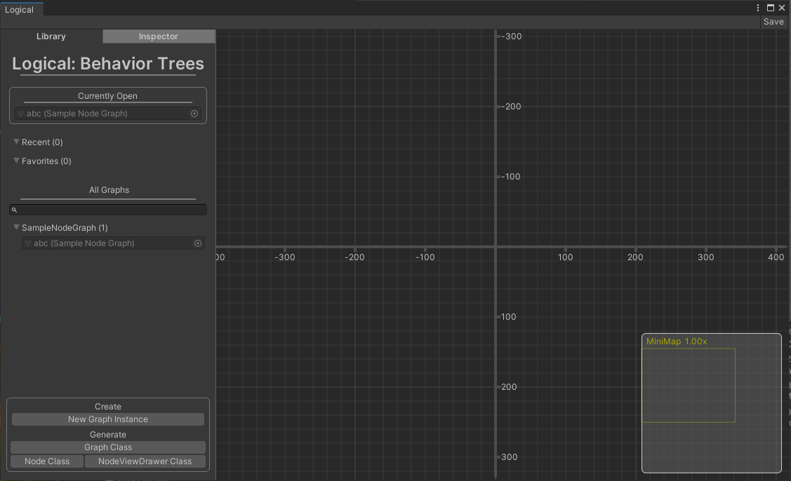

# Logical: Behaviour Trees

## What it is
**Logical: Behaviour Trees** is a node-graph-based editor system to easily develop and visualize tree structured data.
As the name implies, the most obvious use case for this would be AI behaviour trees and similar scenarios where logic needs to branch out. 

Logical was developed to be extremely generic to allow any type of data to be represented in node-graph form while following a small handful of rules.  

Logical was built entirely using Unity's new UIToolkit and utilizes their experimental GraphView system to display the graphs. However, for ease of use, every customizable view allows supports both UIToolkit and IMGUI in their implementations.

## Features

- Fully customizable nodes, node drawers (what gets drawn on the node), and node inspectors (what the inspector draws when selecting a node). 
  

- Copy and Pasting of nodes within instances of the same graph type.

- Graph Library window that automatically finds all node graph instances in the project and sorts them in a recents view, a favorites view, and a all view with a search bar.

- Code generation with thorough comments when creating new graph types, graph instances, node types, and node drawer types. Everything you need can be created right from the editor window.

- Very clean serialization of the data. Node graph instances are saved as ScriptableObjects where each node is serialized using Unity's standard serialization practices with the addition of a few strings to denote port ID's and connections to those port ID's. Each node also serializes a single Vector3 to retain the position of the node in the node editor. This is the only extra data that is saved alongside the data that is required.

- A simple system to run node graphs at runtime.

- Fully open source. Do whatever you want with it. 

## Requirements
Unity 2020.2 and higher is required because there are a number of changes to Unity's GraphView that this project uses which require 2020.2. Downgrading is possible with a few minor roadbumps that *theoretically* shouldn't be too tricky to resolve. (This project was build on Unity 2020.2.0f1)

This tool requires an intermediate level of Unity Editor scripting to use it effectively. Custom nodes will need pretty property drawers and NodeView drawers, which can be implemented using UIToolkit/IMGUI, for them to be useful.

## Full disclosure
This was a personal project of my throughout the span of 3-4 months and was not production tested. I've used this system in my own hobby games but that does not mean it is bug proof. I moved on from this project many months ago and don't plan on updating it again for a while. And so I decided to make this project public in case it could be useful to others rather than keep it in the closet just to collect dust. Hope you find something useful out of it!

## Future Features 
- Nested graphs + breadcrumbs
- Runtime Mode for the graph editor to visualize the state of a graph while in play mode.